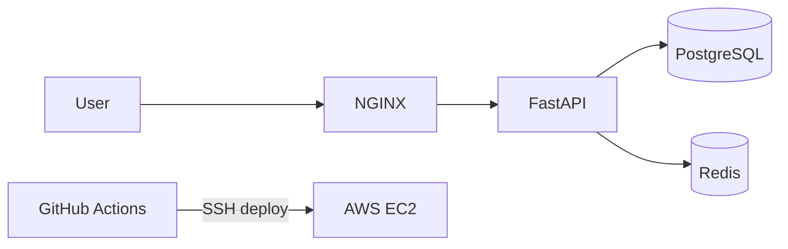

# Assignment AI API — Production Docker Deployment

FastAPI backend with PostgreSQL, Redis, and NGINX, deployed on AWS EC2 with GitHub Actions CI/CD.

## Live deployment

Replace with your EC2 public IP:

- **Health:** `http://<EC2_PUBLIC_IP>/health`
- **API docs:** `http://<EC2_PUBLIC_IP>/docs`
- **Chat:** `POST http://<EC2_PUBLIC_IP>/chat`

## Repository

- **GitHub:** https://github.com/doonops/workspace_aditya
- **Reviewer documentation (English):** [document/README.md](./document/README.md)
- **Learning guides (Hinglish):** [guide/README.md](./guide/README.md)

## Architecture



Details: [document/ARCHITECTURE.md](./document/ARCHITECTURE.md)

## Quick start (local)

```bash
cp .env.example .env
docker compose up -d --build
curl http://localhost/health
```

## CI/CD

Workflow: `.github/workflows/deploy.yml`  
Docs: [document/CI-CD.md](./document/CI-CD.md)

Required GitHub secrets: `EC2_HOST`, `EC2_USER`, `EC2_SSH_KEY`, `APP_PATH`

## API endpoints

| Method | Path | Description |
|--------|------|-------------|
| GET | `/` | Service metadata |
| GET | `/health` | Health check (Postgres + Redis) |
| POST | `/chat` | Chat (rule-based; optional OpenAI) |

## Environment variables

See [document/ENVIRONMENT.md](./document/ENVIRONMENT.md) and `.env.example`.

## Security, SSL, logging, backup

| Topic | Document |
|-------|----------|
| Security | [document/SECURITY.md](./document/SECURITY.md) |
| SSL (no domain) | [document/SSL.md](./document/SSL.md) |
| Logging & backup | [document/LOGGING-AND-BACKUP.md](./document/LOGGING-AND-BACKUP.md) |
| Deployment | [document/DEPLOYMENT.md](./document/DEPLOYMENT.md) |
| Walkthrough | [document/WALKTHROUGH.md](./document/WALKTHROUGH.md) |

## Project structure

```text
app/                    FastAPI application
nginx/                  Reverse proxy
docker-compose.yml      Full stack
.github/workflows/      CI/CD
document/               English docs for reviewers
guide/                  Hinglish guides for developers
scripts/                Local dev and backup helpers
```
