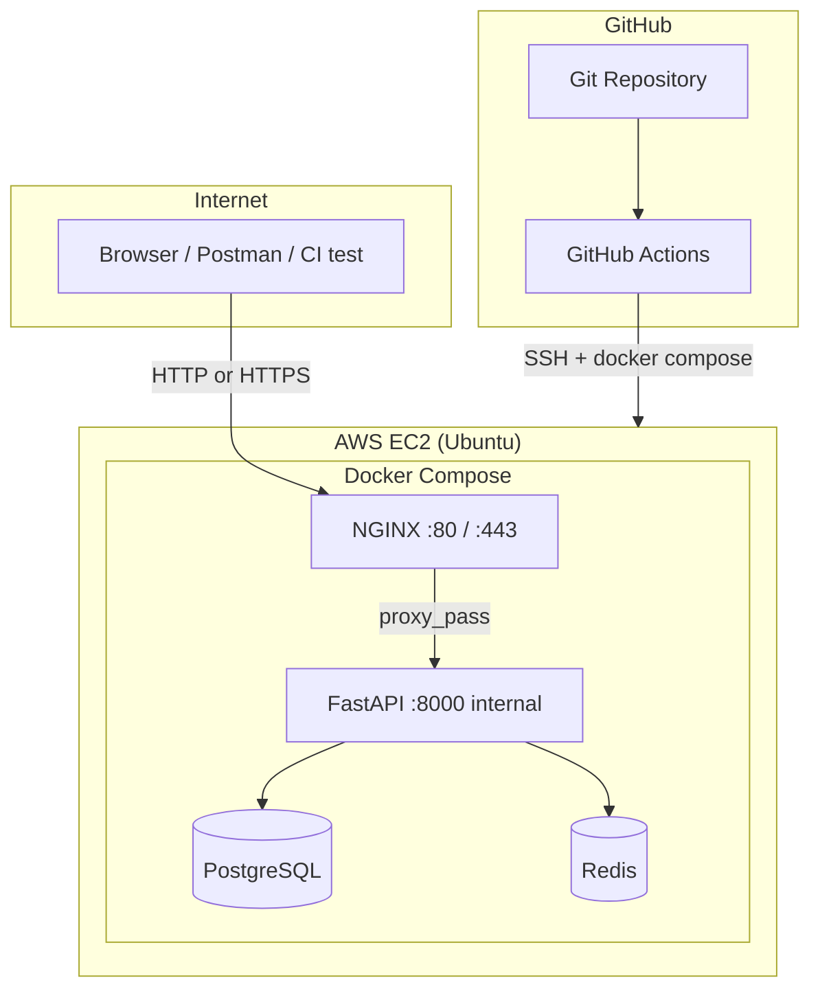

# Phase 0 — Overview (pehle yeh padho)

## Assignment ka goal

Ek chhoti **AI/backend API** ko production-style tarike se deploy karna:

- Containers (Docker)
- Multiple services (API, DB, cache, proxy)
- Cloud server (**AWS EC2**)
- Automatic deploy (**GitHub Actions**)
- Security, logging, backup — documented

Evaluator ko dikhana hai: tum samajhte ho **kaise real apps deploy hoti hain**, sirf local `uvicorn` nahi.

---

## Architecture diagram



### Traffic flow (simple)

1. User `http://EC2_IP/` hit karta hai → **NGINX** (port 80)
2. NGINX request **FastAPI** ko forward karta hai (internal port 8000)
3. FastAPI **PostgreSQL** se data, **Redis** se cache/session
4. Code change → GitHub push → **Actions** EC2 pe SSH karke containers restart

---

## 3 environments (concept)

| Environment | Kahan | Purpose |
|-------------|-------|---------|
| **Local** | Tumhara laptop | Develop + `docker compose up` test |
| **EC2** | AWS | Real deployment (assignment demo) |
| **CI** | GitHub Actions | Build/test/deploy automation |

---

## Services — kyun alag-alag?

| Service | Role | Public expose? |
|---------|------|----------------|
| **FastAPI** | Business logic, `/health`, AI endpoint | ❌ Sirf NGINX ke through |
| **PostgreSQL** | Persistent data | ❌ Never public |
| **Redis** | Cache, rate limit, sessions | ❌ Never public |
| **NGINX** | Reverse proxy, SSL termination, static | ✅ Port 80/443 |

---

## Phases ka flow (visual)

```text
Phase 1: Code (FastAPI)
    ↓
Phase 2: Dockerfile (ek container)
    ↓
Phase 3: Compose (API + DB + Redis)
    ↓
Phase 4: NGINX + env vars
    ↓
Phase 5: EC2 pe manual deploy (seekhna)
    ↓
Phase 6: Security hardening
    ↓
Phase 7: GitHub Actions (auto deploy)
    ↓
Phase 8–9: Logging, backup, SSL docs
    ↓
Phase 10: Final README, video, submit
```

**Rule:** Pehle **manual EC2 deploy** (Phase 5), phir **CI/CD** (Phase 7). Warna debug mushkil hoti hai.

---

## Environment variables (overview)

Baad mein `.env.example` mein detail; abhi concept:

| Variable | Example | Kahan use |
|----------|---------|-----------|
| `DATABASE_URL` | `postgresql://user:pass@db:5432/app` | FastAPI → Postgres |
| `REDIS_URL` | `redis://redis:6379/0` | FastAPI → Redis |
| `APP_ENV` | `production` | Logging level |
| `SECRET_KEY` | random string | Sessions (if needed) |
| `OPENAI_API_KEY` | optional | AI endpoint (bonus) |

**Kabhi GitHub / git mein real `.env` commit mat karo.**

---

## AWS EC2 — is project mein kya hai

- **EC2** = tumhara Linux server (VPS jaisa)
- **Security Group** = AWS firewall (ports 22, 80, 443)
- **Key pair (.pem)** = SSH login
- **Elastic IP** (optional) = IP fix rahe deploy ke baad

Detail: [phase-05-aws-ec2.md](./phase-05-aws-ec2.md)

---

## Domain nahi — phir bhi kya milega evaluator ko

- `http://<EC2_PUBLIC_IP>/health` — live health check
- Docs: production mein domain + Let's Encrypt ka plan
- Optional: DuckDNS / nip.io free subdomain (bonus)

---

## Master checklist (copy karke track karo)

- [ ] Phase 1: FastAPI local run
- [ ] Phase 2: `docker build` success
- [ ] Phase 3: `docker compose up` — 4 services healthy
- [ ] Phase 4: NGINX se API reachable `localhost`
- [ ] Phase 5: EC2 pe same stack, IP se browser test
- [ ] Phase 6: Security group + SSH + ufw documented
- [ ] Phase 7: Push to `main` → auto deploy
- [ ] Phase 8: Logging + backup doc + script
- [ ] Phase 9: SSL approach documented
- [ ] Phase 10: README, diagram, video/instructions

---

## Meri progress

| Item | Status | Date |
|------|--------|------|
| Overview padh liya | ⬜ | |
| Architecture samajh aa gayi | ⬜ | |

**Notes / errors:**

```text
(yahan likho)
```
