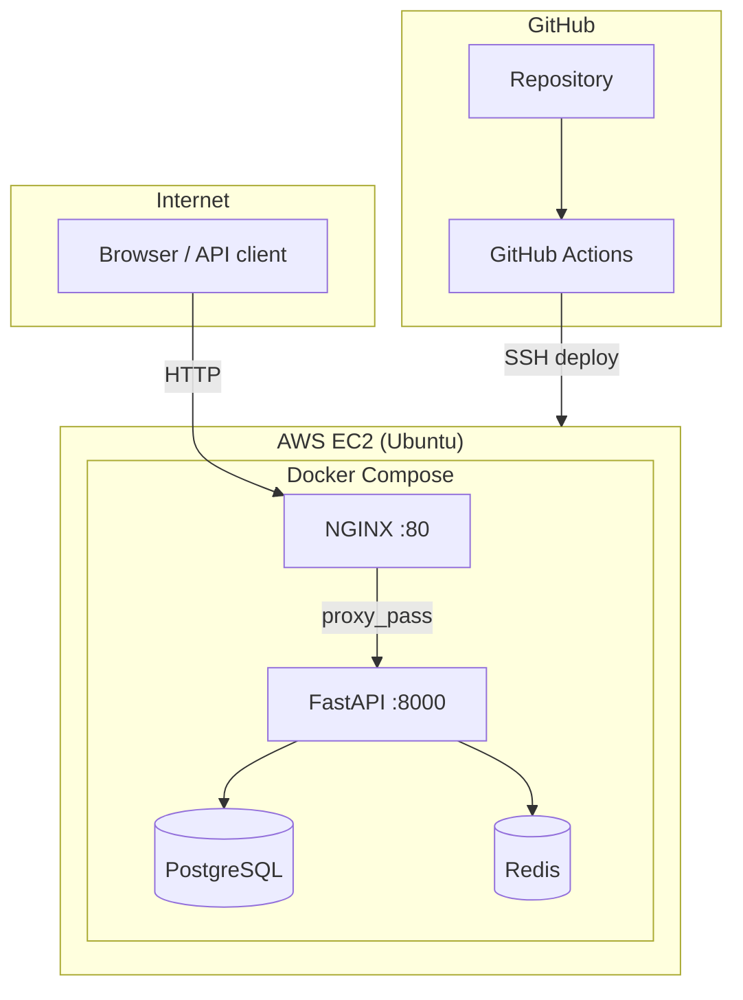

# Architecture

## Overview

A containerized FastAPI backend deployed on AWS EC2 with PostgreSQL, Redis, and NGINX. GitHub Actions automates deployment over SSH.

## Diagram



## Components

| Component | Role | Exposed publicly |
|-----------|------|------------------|
| **NGINX** | Reverse proxy, single entry on port 80 | Yes (80, 443 optional) |
| **FastAPI** | REST API, `/health`, `/chat` | No (internal network only) |
| **PostgreSQL** | Persistent relational data | No |
| **Redis** | Cache / session store | No |
| **GitHub Actions** | Build and deploy on push to `main` | N/A (CI runner) |

## Request flow

1. Client calls `http://<EC2_IP>/` or `/health`.
2. NGINX forwards the request to `api:8000` on the Docker network.
3. FastAPI checks PostgreSQL and Redis for `/health`.
4. On `git push` to `main`, GitHub Actions SSHs to EC2, runs `git pull` and `docker compose up -d --build`.

## Repository layout

```text
app/                    FastAPI application
nginx/nginx.conf        Reverse proxy configuration
docker-compose.yml      Multi-service stack
Dockerfile              API container image
.github/workflows/      CI/CD
document/               Reviewer documentation (this folder)
guide/                  Builder learning guides (Hinglish)
```
