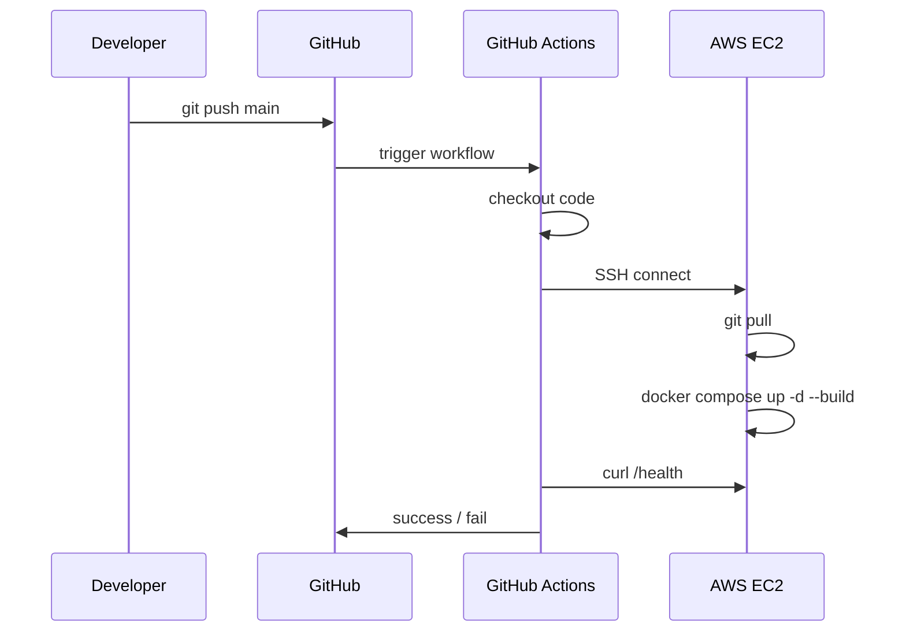

# Phase 7 — CI/CD with GitHub Actions

## Is phase mein kya banega

Har push `main` branch pe → automatically:

1. (Optional) Lint / test
2. SSH to EC2
3. `git pull` + `docker compose up -d --build`
4. Health check verify

### File

```text
.github/workflows/deploy.yml
```

---

## Flow diagram



---

## GitHub Secrets setup

Repo → **Settings** → **Secrets and variables** → **Actions** → New repository secret:

| Secret name | Value |
|-------------|-------|
| `EC2_HOST` | Elastic IP ya public IP |
| `EC2_USER` | `ubuntu` |
| `EC2_SSH_KEY` | Poora `.pem` file content (private key) |
| `APP_PATH` | `/opt/app` |

Optional: `HEALTH_URL` = `http://EC2_HOST/health`

---

## Actual workflow file

Workflow isi file mein hai: `.github/workflows/deploy.yml`

**Kya karta hai:**

1. EC2 pe SSH connect karta hai
2. `$APP_PATH` mein `git pull --ff-only origin main` run karta hai
3. `docker compose up -d --build` se containers rebuild + restart karta hai
4. Server ke andar `http://localhost/health` se polling karke health check confirm karta hai
5. Failure pe last logs (`docker compose logs --tail=200 api nginx`) print karta hai

**Note:** Pehli baar server pe repo `git clone` manual (Phase 5). Baad mein sirf `git pull`.

---

## Exactly kahan kya configure hota hai? (mapping)

### GitHub (repo settings)

- Path: **Repo → Settings → Secrets and variables → Actions**
- Yahin `EC2_HOST`, `EC2_USER`, `EC2_SSH_KEY`, `APP_PATH` add hote hain.

### AWS (Security Group)

- Path: **EC2 → Instance → Security → Security groups → Inbound rules**
- Minimum: `22` (my IP), `80` (0.0.0.0/0)

### EC2 server (filesystem)

- Path: `/opt/app` (repo root)
- File: `/opt/app/.env` (secrets)
- Command: `docker compose up -d --build`

Quick reference: [ec2-github-config.md](./ec2-github-config.md)

---

## Server pe git access

### HTTPS + PAT

```bash
cd /opt/app
git remote -v
# GitHub Personal Access Token use for private repo
```

### Deploy key (better for CI)

1. Server pe: `ssh-keygen -t ed25519 -C "deploy"`
2. Public key → GitHub repo → Deploy keys (read-only)
3. Server se `git pull` without password

---

## Deploy strategies

| Strategy | Complexity | Assignment |
|----------|------------|------------|
| SSH + git pull + compose rebuild | Low | ✅ Recommended |
| Build image in Actions, push to ECR | Medium | Bonus |
| Blue-green / zero downtime | High | Bonus (Phase 10) |

---

## Rollback (simple)

```bash
cd /opt/app
git log --oneline -5
git checkout <previous-commit>
docker compose up -d --build
```

Doc mein "rollback steps" likho.

---

## Troubleshooting CI

| Problem | Check |
|---------|-------|
| missing server host | `EC2_HOST` secret missing/empty OR wrong secret name |
| SSH failed | Secret key format, `\n` newlines, Security Group port 22 |
| Permission denied | `ubuntu` user, `/opt/app` ownership |
| Health check fail | App logs, `.env` on server |
| git pull fail | Deploy key / credentials |

---

## Is phase ka output

- [ ] `.github/workflows/deploy.yml` in repo
- [ ] GitHub Secrets set
- [ ] Test push → deploy → `/health` OK
- [ ] Actions run screenshot for submission

---

## Agli phase

[phase-08-logging-backup.md](./phase-08-logging-backup.md)

---

## Meri progress

| Step | Status | Date |
|------|--------|------|
| Secrets added | ⬜ | |
| workflow.yml | ✅ | 2026-05-27 |
| Test deploy success | ⬜ | |

**Notes / errors:**

```text

```
