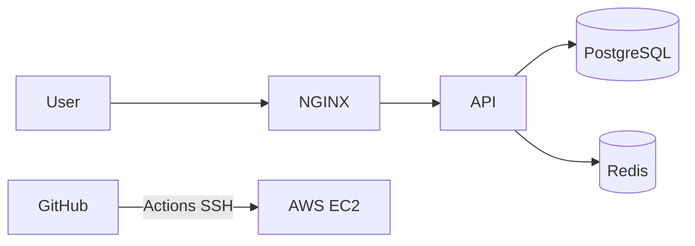

# Phase 10 — Final Deliverables & Submission

## Assignment ko complete karne ke liye yeh sab chahiye

---

## 1. GitHub repository

| Item | Location |
|------|----------|
| FastAPI code | `app/` |
| Docker | `Dockerfile`, `.dockerignore` |
| Full stack | `docker-compose.yml` |
| NGINX | `nginx/nginx.conf` |
| CI/CD | `.github/workflows/deploy.yml` |
| Env template | `.env.example` |
| Main readme | `README.md` |
| Deep docs | `document/` (yeh folder) |

### README.md minimum sections

1. Project description
2. Architecture diagram (Mermaid copy from [00-overview.md](./00-overview.md))
3. Quick start local
4. Deploy to EC2 summary
5. Live URL: `http://<YOUR_EC2_IP>/health`
6. Environment variables table
7. SSL section (link phase-09)
8. Security measures list
9. Backup & restart summary

---

## 2. Live deployment proof

- [ ] `http://<EC2_IP>/health` returns JSON `status: ok`
- [ ] `POST /chat` works from curl/Postman
- [ ] Screenshot / short screen recording

---

## 3. Deployment documentation

Already in `document/` — submission ke time ensure:

- [ ] Phase 5 EC2 steps followed (with your real IP filled)
- [ ] Phase 6 security checklist done
- [ ] Phase 7 CI screenshot
- [ ] Phase 8 backup tested once

**Optional merge:** `DEPLOYMENT.md` in root = shortened copy of phases 5–9.

---

## 4. Architecture diagram

Use in README (from overview):



Export: GitHub Mermaid render / [mermaid.live](https://mermaid.live) PNG.

---

## 5. Video OR written walkthrough

**Option A — Video (5–10 min)**

1. Architecture explain (1 min)
2. Local `docker compose up` (2 min)
3. EC2 Security Group (1 min)
4. Browser `http://IP/health` (1 min)
5. Git push → Actions deploy (2 min)
6. Security + backup mention (1 min)

**Option B — Written (no camera)**

`document/WALKTHROUGH.md` with numbered steps + screenshots:

1. EC2 launch screenshot
2. `docker compose ps` on server
3. Browser health check
4. GitHub Actions green check
5. `curl` output paste

Dono acceptable — assignment mein "OR" likha hai.

---

## 6. Evaluation criteria — self check

| Criteria | Tumne kahan dikhaya |
|----------|---------------------|
| Production deployment | EC2 live URL |
| Docker & NGINX | compose + nginx.conf |
| CI/CD quality | deploy.yml + green run |
| Infrastructure org | `document/` phases |
| Security | phase-06 + Security Group |
| Reliability | health + restart + backup |
| Documentation | README + document/ |
| Debugging | progress notes, logs commands |

---

## Bonus points checklist

- [ ] Monitoring (Uptime Kuma / CloudWatch) — 1 paragraph + optional container
- [ ] fail2ban — phase-06
- [ ] Zero-downtime — 2 API replicas + nginx upstream (advanced)
- [ ] AI/LLM — OpenAI endpoint + secret management
- [ ] Cloudflare — phase-09 (needs domain)
- [ ] Automated backups — phase-08 cron + S3

---

## Suggested submission message (email/portal)

```text
GitHub: https://github.com/USERNAME/REPO
Live health: http://X.X.X.X/health
Docs: /document/README.md
CI/CD: Actions tab — Deploy to EC2 workflow
Video: <link> OR see document/WALKTHROUGH.md
```

---

## After submission — cost control

```bash
# AWS — stop instance when not demoing
EC2 → Instance state → Stop

# Or terminate if done forever (data lost unless snapshot)
```

---

## Meri progress — FINAL

| Deliverable | Status | Link |
|-------------|--------|------|
| GitHub repo public | ⬜ | |
| Live /health | ⬜ | |
| CI/CD working | ⬜ | |
| README complete | ⬜ | |
| Video OR WALKTHROUGH | ⬜ | |
| Submitted | ⬜ | |

**Repo URL:** `________________`

**Live URL:** `________________`

**Notes:**

```text

```
